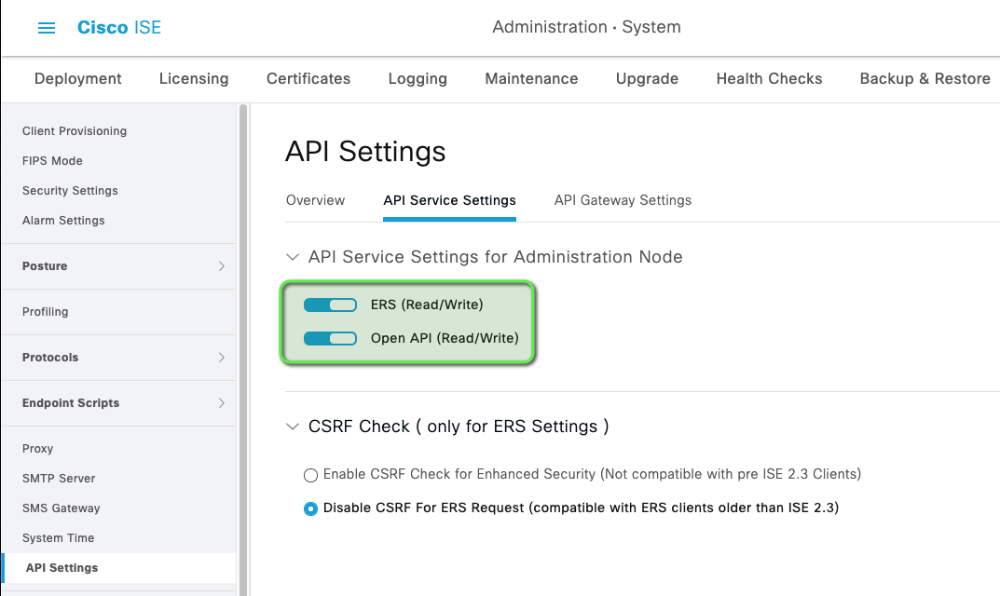

# Ansible Playbooks for Cisco Identity Services Engine (ISE)

A set of [Ansible](https://www.ansible.com/) playbooks to configure a freshly installed Cisco Identity Services Engine (ISE) for simple operation; in my case, a basic [Cisco Software-Defined Access](https://www.cisco.com/c/en/us/solutions/enterprise-networks/software-defined-access/index.html) environment.

> **UPDATE:** I have redone this project using Python in case you want to compare methods.  That project is available [here](https://github.com/eiddor/ise-automation-python).
### Features
These playbooks will configure the following in ISE:

* local user groups (`01_add_groups.yaml`)
* local user identities (`02_add_users.yaml`)
* a simple TACACS profile and command set for privilege 15 access (`03_create_tacacs_profiles.yaml`)
* TACACS policies in the default policy set (`05_create_tacacs_authz_policies.yaml`)
* Scalable Group Tags (SGT) to allow our authentication rules to work (`06_create_sgts.yaml`)
* network access authorization rules to places users in the appropriate VLANs (wired and wireless) (`08_create_authorization_profiles.yaml`)
* network access policies to authorize users and assign SGTs (`09_create_authorization_policies.yaml`)
* a complete wired guest workflow with redirection, portal, and SGT(`10_create_guest_authz_profiles.yaml` & `11_create_guest_authz_policies.yaml`)
* Cisco access point profiling (using the wired guest flow) and authorization profiles (`12_access_point_profiling.yaml`)

The resources that are configured with these playbooks are enough to support a basic Cisco SD-Access network including:

* TACACS authentication for network devices
* dot1x authentication and authorization for multiple users
* wired guest access
* multiple Scalable Group Tags (SGTs)
* Cisco access point profiling and authorization

### Background

I administer a lab environment that is used to demonstrate Cisco Software-Defined Access for customers.  When new versions of [Cisco ISE](https://www.cisco.com/c/en/us/products/security/identity-services-engine/index.html) or [DNA Center](https://www.cisco.com/c/en/us/products/cloud-systems-management/dna-center/index.html) are released, I do a fresh installation of both so that I can test the new versions with the lab workflow.  This involves installing each piece of software and then configuring them both to the point where I can start going through the lab guide.

After watching a demo of the collections in [this repo](https://github.com/hosukw/20210928-IBN-Demo) that use Terraform and Ansible to spin-up and configure ISE in AWS, I was inspired to setup something similar to assist in my configuration process when testing new versions.

I started with almost zero API experience beyond installing Postman on my workstation in the past and never using it.  Prior to this project I had run exactly one Ansible playbook in my life, and that was six years ago.  Needless to say, I was (and still am) completely green with this stuff, so it was a complete learning experience for me, especially not having a background in code or data structures.  To that end, I have tried to structure and comment the playbooks to make it easy for someone like me to pick up and get working without much effort.

As a bonus: You will notice some snark in the playbook comments as well, which stemmed from some frustrations that I ran into while learning.
### Requirements

#### Server
* [Cisco Identity Services Engine](https://www.cisco.com/c/en/us/products/security/identity-services-engine/index.html) (ISE) 3.1 or higher

> **Note:** Some of these playbooks may work with ISE 3.0, but 3.1 is required for the policy stuff.
#### Workstation
* [Python](https://www.python.org/) 3.6+
* [Ansible](https://www.ansible.com/) 2.9 or higher
* [Cisco ISE SDK v1.0.0](https://github.com/CiscoISE/ciscoisesdk)+
* [Ansible Modules for Cisco ISE](https://galaxy.ansible.com/cisco/ise)
* [JMESPath](https://github.com/jmespath/jmespath.py) for JSON filtering

> See the instructions on the Ansible Modules for Cisco ISE site for more installation details.
### Quick Start

If you just want to see these in action, you can run them against a Cisco DevNet [ISE 3.1 APIs, Ansible, and Automation](https://devnetsandbox.cisco.com/RM/Diagram/Index/ad4bb2ae-bb67-4d93-9f0d-2a6a04792e2e?diagramType=Topology) sandbox instance without any customization:

* On your local workstation install [requirements](#requirements) above:

**Ansible**:
> `sudo pip install ansible`

**Cisco ISE SDK:**
> `sudo pip install ciscoisesdk`

**Ansible ISE Collection:**
> `ansible-galaxy collection install cisco.ise`

**JMESPath:**
> `pip install jmespath`

* Reserve a sandbox in DevNet and connect to it per their instructions

* In ISE, enable **ERS** and **Open API** settings in: _Administration | Settings | API Settings | API Service Settings_



* Run the playbooks one at a time like this:

> `$ ansible-playbook -i hosts 01_add_groups.yaml` 

> `$ ansible-playbook -i hosts 02_add_users.yaml` 

> `$ ansible-playbook -i hosts 03_create_tacacs_profiles.yaml`

* You can verify the changes in the ISE GUI after each playbook if you're curious
### Usage Notes

Although my use-case for these playbooks involves a fresh deployment of ISE to support a Cisco SD-Access topology, they can absolutely be modified and used in a brownfield ISE environment without SDA.

I'm going to try to make the project self-documenting via comments as best I can, but here's a rough guide to get started:

`credentials.yaml` - Contains the ISE deployment information such as hostname, username, and password

`groupsandusers.yaml` - Contains the internal identity groups and users that will be configured by the playbooks

`policy.yaml` - Contains the policy/profile information that will be configured by the playbooks

* I developed these playbooks using Cisco DevNet's [ISE 3.1 APIs, Ansible, and Automation](https://devnetsandbox.cisco.com/RM/Diagram/Index/ad4bb2ae-bb67-4d93-9f0d-2a6a04792e2e?diagramType=Topology) sandbox, so they should be useable there without any modification (See [Quick Start](#quick-start) section)

* If you're using macOS you may receive this error when running your playbook:

```
objc[34120]: +[__NSCFConstantString initialize] may have been in progress in another thread when fork() was called.
objc[34120]: +[__NSCFConstantString initialize] may have been in progress in another thread when fork() was called. We cannot safely call it or ignore it in the fork() child process. Crashing instead. Set a breakpoint on objc_initializeAfterForkError to debug.
ERROR! A worker was found in a dead state
```

Try setting these environment variables:

```
export OBJC_DISABLE_INITIALIZE_FORK_SAFETY=YES
export no_proxy=*
```

### Other ISE Settings

One day I will post a summary of some of the ISE settings that I change to make my life a little easier following an install.  These settings will be pretty specific to a lab environment and not suggested for production.
### TODO

* ~~better documentation~~
* even more better documentation
* really good documentation
* documents
* better comments in the playbooks
* better optimization of the playbooks
* ~~separate environment-specific values into dedicated files for easier customization~~
* add more optional fields to make this useful in the real world
* ~~redo this whole mess in Python before I retire~~ (**NOTE:** I beat the deadline - the Python version of these playbooks is available [here](https://github.com/eiddor/ise-automation-python))

### Acknowledgements

This was definitely a learning exercise for me and just something I wanted to see if I could pull off on my own.  That said, I want to thank [John Capobianco](https://github.com/automateyournetwork) for helping point me in the right direction for certain things and only pressuring me to use Python twelve times a day instead of the usual twenty.  I also want to thank [Josh Bronikowski](https://github.com/jbronikowski) for helping me figure out that the ISE API requires extra fields for some calls, and Ryan Malone for some JSON tips.
### Questions?

Please open an issue if you have any questions or suggestions.  

I developed these playbooks for my own use, so I do want to keep them as clean as I can, but if you think they can be improved or optimized, feel free to submit a PR.

